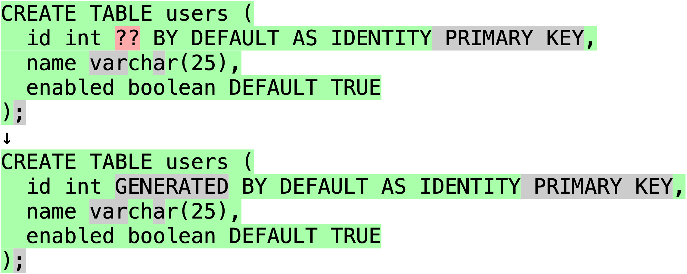
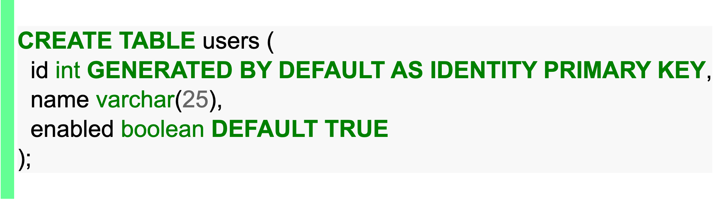

# Anki Add-on: Multi-Line Type Answer Box w/ Semantic Diff

An add-on for [Anki Spaced Repetition Software](https://apps.ankiweb.net/) that embeds an input text area for reviewing notes that need typed multi-line answers. Great for remembering certain code concepts, passages of poetry, or any other long-form answer you want to type without prompts. You might use cloze deletion notes to gradually develop mastery, then add a long-form note to test that you can explain a holistic concept that comprises the facts.

This project is a fork of [this repo](https://github.com/robbielaldrich/ankiTypebox) for the [Multi-Line Type Answer Box](https://ankiweb.net/shared/info/681236951) add-on, which is no longer maintained. Here's what this add-on contributes:

- Support for Anki v2.1.56.
- Support for content with `\` characters (like regular expressions)
- A consolidated and Anki-familiar semantic difference output (thanks to [this Google-owned project](https://github.com/google/diff-match-patch/)) when a card is answered incorrectly:
  - [Comparison when incorrectly answered](#comparison-when-incorrectly-answered)
  - [Comparison when correctly answered](#comparison-when-incorrectly-answered)
- [Coming to the Anki Add-on library soon](#coming-to-the-anki-add-on-library-soon)

***

## Example `Type Multi-Line` Note

A few long-form notes in your recall practice help you test yourself on complete concepts without the prompts inherent in cloze deletion notes.


*Associated HTML content:*

```html
<table class="highlighttable"><tbody><tr><td class="code">
  <div class="highlight" style="background: #f8f8f8">
    <pre style="line-height: 125%"><span style="color: #008000; font-weight: bold">CREATE</span> <span style="color: #008000; font-weight: bold">TABLE</span> users (
  id <span style="color: #008000">int</span> <font color="#008000"><b>GENERATED BY DEFAULT AS IDENTITY PRIMARY KEY</b></font>,
  name <span style="color: #008000">char</span>(<span style="color: #666666">25</span>),
  enabled <span style="color: #008000">boolean</span> <span style="color: #008000; font-weight: bold">DEFAULT</span> <font color="#008000"><b>TRUE</b></font>
);</pre>
  </div>
  </td></tr></tbody></table>
```

### Comparison when incorrectly answered

*Incorrect input text:*

```text
CREATE TABLE users (
  id int GENERATED BY DEFAULT AS IDENTITY,
  name char(30),
  enabled boolean DEFAULT TRUE
)
```

#### Anki's output when answered incorrectly



Notice how Anki's comparison requires looking at *two separate blocks to get the full picture of incorrect vs correct*. That's not too bad when comparing the single lines of text for which Anki's system was designed.

Regardless of how many lines you're comparing, that comparison layout can significantly slow you down.

#### This add-on's output when answered incorrectly

This layout enables a user to focus on what's incorrect, including adjacent ~~incorrect~~correct values to speed up learning.


### Output when correctly answered

*Correct input text:*

```text
CREATE TABLE users (
  id int GENERATED BY DEFAULT AS IDENTITY PRIMARY KEY,
  name char(25),
  enabled boolean DEFAULT TRUE
);
```

#### Anki's output when answered correctly


#### This add-on's output when answered correctly



***

## Coming to the Anki Add-on library soon

Because the original add-on is no longer maintained, I intend to publish this as a separate add-on in the near-future, then maintain it as long as I have the time. Until then, you can copy the code in this repository into your local Anki add-ons folder for local use (the add-on will only be available on the device to which you copy the files). Steps:

1. Locate the *Multi-Line Type Answer Box* files: `Shift + Cmd/Ctrl + A`, select the add-on, click *View Files* to open the folder.
2. Go up one level and duplicate the folder `681236951` to back up the current contents.
3. Copy all files in this repository (you can exclude the README.md and `readme` folder) to the `681236951` folder.
4. Restart Anki.
   1. No need to modify your existing *Type Multi-Line* notes; just enjoy a more reliable and less tedious recall practice when you get long-form answers wrong.
   2. Feel free to add the notes that previously caused errors.
   3. **If anything goes wrong:**
      1. Delete the `681236951` add-on folder that contains this repo's code.
      2. Rename the copy you created in the step above to `681236951`
      3. Restart Anki.
         1. If you didn't create a backup, or if that doesn't work, delete the add-on in Anki, then add it again by clicking *Get Add-ons* and pasting in the add-on ID: `681236951`.
